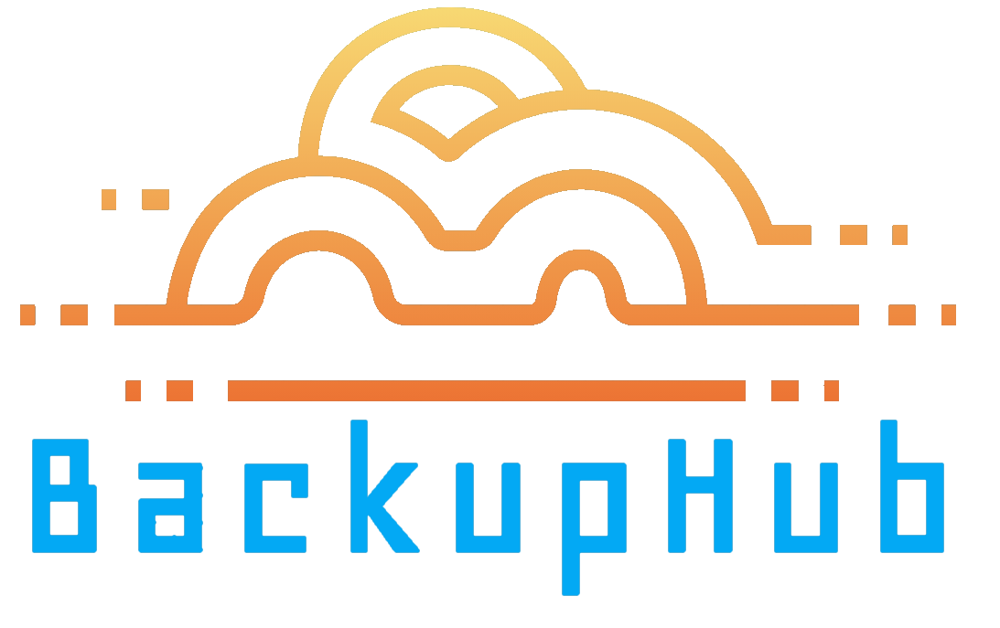

# BackupHub

**A lightweight, secure, and flexible solution for managing and scheduling shell-based executions across your network.**

BackupHub is designed for IT administrators, providing secure, encrypted communication between a central hub and remotely managed agents. It streamlines job execution, scheduling, monitoring, and notifications, making it an effective tool for backup and automation tasks.


<p align="left">
   <a href="https://github.com/dpembo/BackupHub/actions"></a>
   <a href="https://github.com/dpembo/BackupHub/blob/main/LICENSE"></a>
   <a href="https://github.com/dpembo/BackupHub/releases"></a>
</p>

## Table of Contents
- [Features](#features)
- [Technology Stack](#technology-stack)
- [Installation](#installation)
- [Usage](#usage)
- [Configuration](#configuration)
- [Contributing](#contributing)
- [License](#license)
- [Support](#support)


## Features

**Management Features**
- Agent provisioning: cron, system service, Docker, or PM2
- Centralized agent management and user management (multi-user, RBAC)
- Dashboard insights: visualize job performance and system status

**Execution & Scheduling**
- Secure, token-based script execution
- Inline script editor with templates
- Flexible scheduling: daily, weekly, monthly, threshold-based
- Timezone support for global operations

**Communication & Notifications**
- Real-time updates via WebSocket/MQTT
- Alerts: email, webhooks, in-app, and console
- Customizable UI


## Backup Templates Included
- **Backup Proxmox VM**: Backs up a VM from Proxmox given the VM ID
- **Backup MySQL/MariaDB DB**: Runs a MySQL dump of a database and moves it to a directory
- **Delete Files**: Deletes files from a provided list
- **Issue Reboot**: Issues a reboot after a given delay
- **Purge Files Older Than**: Purges files older than a defined period (in days)
- **Purge Files Matching Wildcard Older Than**: Purges files that match a wildcard and are older than a defined period (in days)
- **Rsync Between Two Directories**: Performs a one-way Rsync between provided source and target directory
- **Mount Threshold Exceeded**: Sample to use when a mounted volume uses storage greater than the value provided in settings
- **Upload to Cloud Storage**: Using rclone, allows you to move files to many different cloud storage providers


## Technology Stack
| Component      | Description                                      |
|---------------|--------------------------------------------------|
| Hub           | Node.js, web-based interface                     |
| Agents        | Node.js CLI, Linux, Bash for script execution    |
| Communication | Encrypted (shared secret), WebSocket/MQTT        |
| Notifications | Email, webhooks, in-app, console                 |


## Quick Start
**Recommended:** Use Docker for the hub. Agents can be installed separately on Linux hosts.

### Prerequisites
- Node.js (v20+)
- Docker (recommended for BackupHub server deployment)
- Linux environment for agents

### Docker Setup (Recommended)
```bash
docker pull ghcr.io/dpembo/backuphub/hub:latest
docker run -d --name BackupHub -e TZ=Europe/London -p 8082:8082 -p 49981:49981 --restart unless-stopped \
  -v /custom/BackupHub/data:/usr/src/app/data \
  -v /custom/BackupHub/scripts:/usr/src/app/scripts \
  -v /custom/BackupHub/logs:/usr/src/app/logs \
  ghcr.io/dpembo/backuphub/hub:latest
```
Access the web interface at [http://localhost:8082](http://localhost:8082).

### Manual Setup
```bash
git clone https://github.com/dpembo/BackupHub.git
cd BackupHub
npm install
node server.js
```
Access the web interface at [http://localhost:8082](http://localhost:8082).

For agent installation and advanced configuration, see the [Quick Start Guide](https://github.com/dpembo/BackupHub/blob/main/docs/installation.md).


## Usage

### Initial Setup
1. Open the web interface at [http://localhost:8082](http://localhost:8082).
2. Register a new user (username, email, password).
3. Log in to access the dashboard.

### Agent Setup
1. Go to the **Agents** screen in the web interface.
2. Click the (+) button to generate agent installation commands.
3. Run the commands on the target machine, configuring the agent with a unique name, WebSocket settings, and start method (PM2, cron, or Docker).
4. See the [Quick Start Guide](https://github.com/dpembo/BackupHub/blob/main/docs/installation.md) for more details.

### Managing Jobs
- Use the inline script editor to create or edit scripts.
- Use the templates icon for quick job setup (e.g., `Test-5-Seconds.sh`).
- Templates are available for Proxmox, rsync, MySQL/MariaDB, and more.
- Schedule jobs via the dashboard (daily, weekly, custom).
- Monitor job status and logs in real-time.

### Common Tasks & FAQ
For comprehensive documentation on all features, see:
- **[Installation & Setup](docs/installation.md)** — Getting BackupHub running
- **[Backup Schedules](docs/backup-schedules.md)** — Creating and managing schedules
- **[Orchestrations](docs/orchestrations.md)** — Building complex workflows
- **[User Management](docs/user-management.md)** — User accounts and access control
- **[Configuration & Settings](docs/settings-config.md)** — Server configuration, backup/restore
- **[REST API Reference](docs/REST_API_REFERENCE.md)** — Programmatic API access
- **[Screenshots & UI Reference](docs/screens/)** — Visual guide to the interface
- **[Full Documentation](docs/README.MD)** — Complete documentation index


## Configuration
| Parameter Type         | Details                                                        |
|-----------------------|----------------------------------------------------------------|
| Environment Variables | `TZ` (e.g., `Europe/London`), `BACKUPHUB_ENCRYPTION_KEY`, etc.  |
| Volumes               | `/usr/src/app/data`, `/usr/src/app/scripts`, `/usr/src/app/logs`|
| Ports                 | `8082` (web app), `49981` (WebSocket)                          |

- Configure settings via the web interface or environment variables.
- Ensure the hub and agents use the same secret key for secure communication.
- For a full list of environment variables and configuration options, see [settings-config.md](docs/settings-config.md).


## Contributing
Contributions are welcome!

1. Fork the repository.
2. Create a feature branch: `git checkout -b feature/your_feature`.
3. Commit your changes: `git commit -m 'Add your_feature'`.
4. Push to the branch: `git push origin feature/your_feature`.
5. Open a pull request.

Please adhere to the project’s coding standards and include tests where applicable.
See [tests/TESTING.md](tests/TESTING.md) and [agent/tests/TESTING.md](agent/tests/TESTING.md) for test details.


## License
This project is licensed under the MIT License. See the [LICENSE](https://github.com/dpembo/BackupHub/blob/main/LICENSE) file for details.


## Support
For issues or feature requests, open an issue on [GitHub Issues](https://github.com/dpembo/BackupHub/issues).
For general inquiries, please use GitHub Discussions or open an issue.
