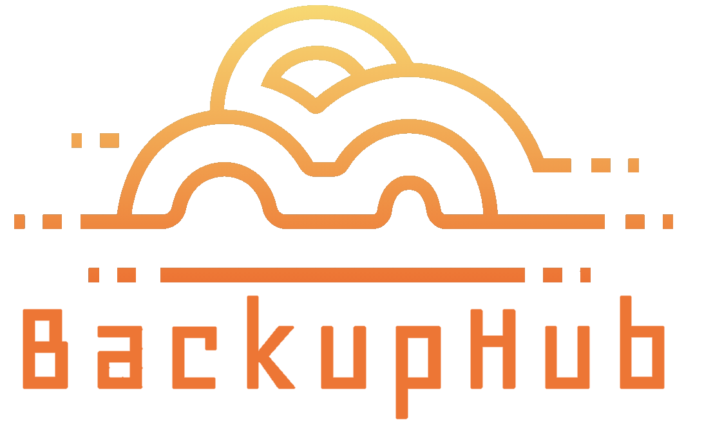

BackupHub is a lightweight yet powerful solution for managing and scheduling shell-based executions across a local area network. Designed for IT administrators, BackupHub ensures secure, encrypted communication between a central hub and remotely managed agents. It streamlines job execution, scheduling, monitoring, and notifications while maintaining a simple yet effective approach to backup and automation.

## Key Features

- **Agent Provisioning** – Deploy agents via cron, system service, Docker, or PM2.
- **Agent Management** – Track agent status (uptime, offline, job execution).
- **Secure Execution** – Token-based authentication protects endpoints from unauthorized execution.
- **Inline Script Editor** – Edit scripts directly in the hub with templated examples.
- **User Management** – Multi-user access with role-based control.
- **Comprehensive Job Monitoring** – View logs, resubmit failed jobs, and track execution status.
- **Dashboard Insights** – Gain visibility into job execution and performance.
- **Flexible Scheduling** – Support for daily, weekly, monthly, and threshold-based execution.
- **Timezone Support** – Ensure job times are correctly displayed for users in different regions.
- **Efficient Communication** – Uses WebSocket (recommended) or MQTT for secure agent-hub interaction.
- **Alerts & Notifications** – Receive notifications via email, webhooks, in-app alerts, or console output.
- **Customizable UI** – Assign icons and colors to categorize jobs visually.

## Technology Stack

- **Hub:** Web-based application powered by **Node.js**.
- **Agents:** CLI-based and run on **Linux**, using **Bash** for script execution.
- **Communication:** Encrypted using a shared secret key, with WebSocket/MQTT for real-time updates.
- **Notifications:** Webhooks for external alerting.

## Installation & Setup

### Install the Hub

- Runs on any Linux environment supporting **Node.js** and **Bash**.
- An installer is provided for seamless deployment.

### Provision Agents

- Agents can be installed and updated directly from the hub.
- They must be configured with the same secret key as the hub for secure communication.

## Open Source

BackupHub is an open-source project hosted on **GitHub**. Its simplicity and efficiency make it a compelling alternative to traditional backup solutions while maintaining powerful automation capabilities.
