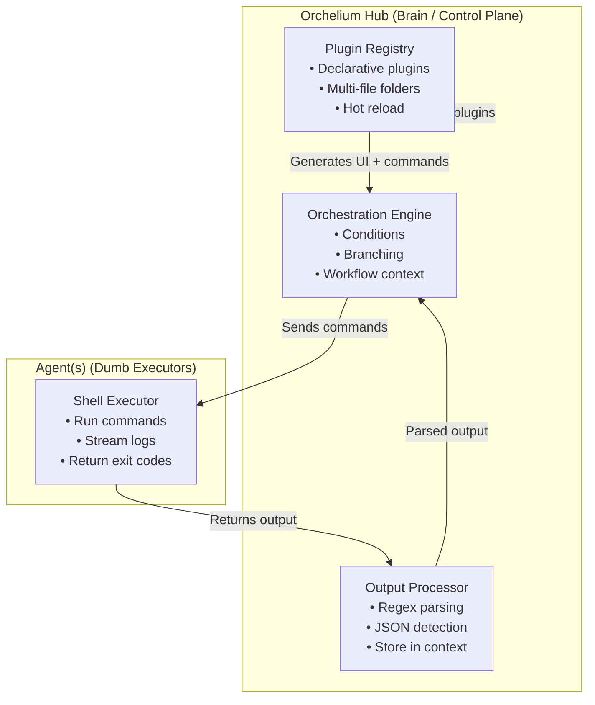

```mermaid
flowchart TD

    subgraph HUB["Orchelium Hub (Brain / Control Plane)"]
        PR["Plugin Registry<br/>• Declarative plugins<br/>• Multi‑file folders<br/>• Hot reload"]
        OE["Orchestration Engine<br/>• Conditions<br/>• Branching<br/>• Workflow context"]
        OP["Output Processor<br/>• Regex parsing<br/>• JSON detection<br/>• Store in context"]
    end

    subgraph AGENTS["Agent(s) (Dumb Executors)"]
        AG["Shell Executor<br/>• Run commands<br/>• Stream logs<br/>• Return exit codes"]
    end

    HUB -->|Loads plugins| PR
    PR -->|Generates UI + commands| OE
    OE -->|Sends commands| AG
    AG -->|Returns output| OP
    OP -->|Parsed output| OE
```