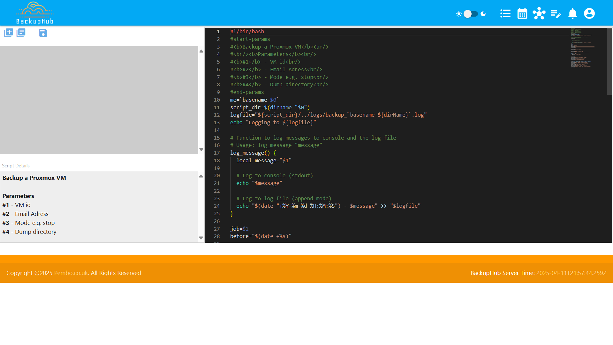
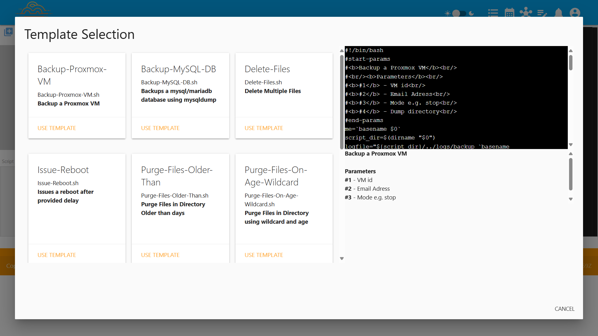
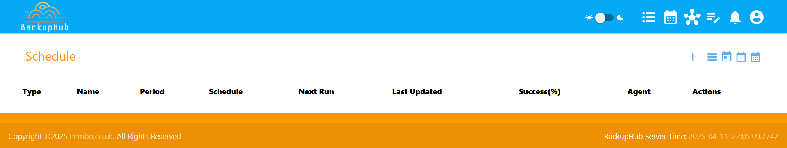
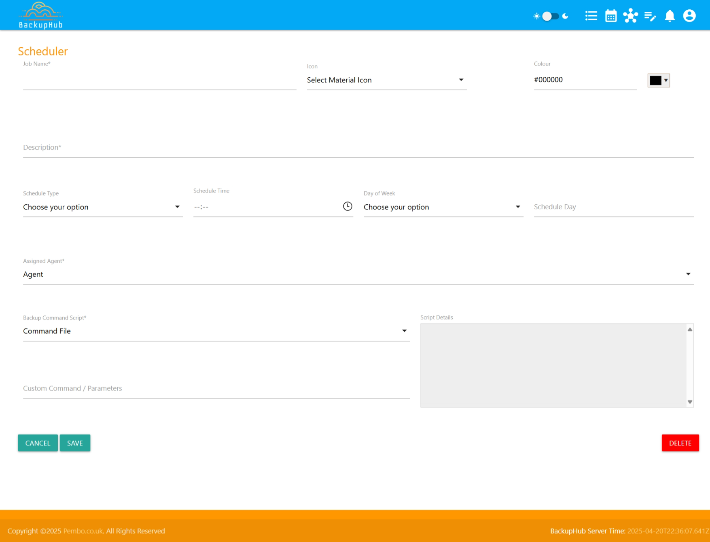
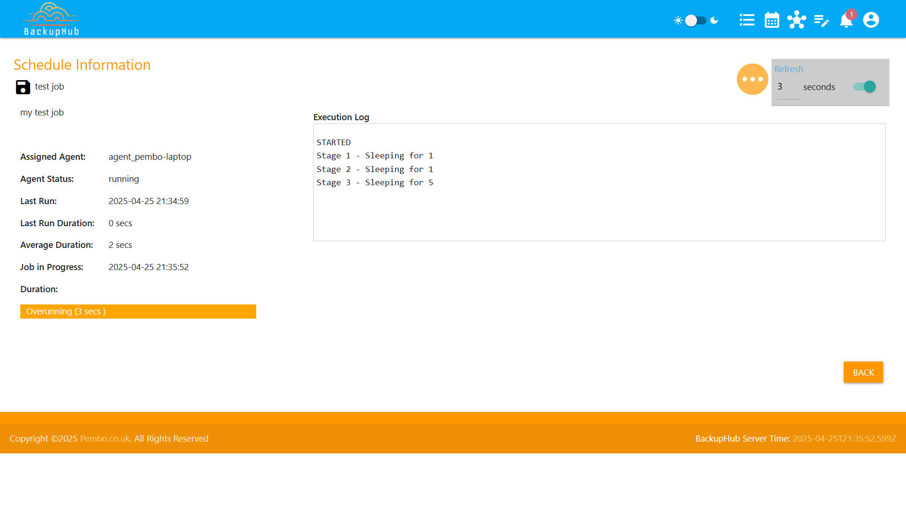

# Rule-Based Scheduling and Thresholds

Orchelium supports rule-based scheduling, allowing jobs to be triggered by system metrics (CPU, disk usage, file count, etc.) using flexible rules. This replaces the old global threshold job system.

## Trigger Context System

When a rule-based threshold triggers a job, the metric data is automatically passed to scripts and orchestrations as **trigger context**. This allows your scripts to make intelligent decisions based on the metric that triggered them.

### Scripts Accessing Metric Data

When your script is triggered by a threshold rule, these environment variables are available:

```bash
# Metric Information
$ORCHELIUM_METRIC_TYPE              # "cpu", "mount_usage", "file_count", etc.
$ORCHELIUM_METRIC_VALUE             # Actual numeric value (92.5)
$ORCHELIUM_METRIC_UNIT              # Unit ("%", "bytes", "count", etc.)
$ORCHELIUM_METRIC_PATH              # Path being monitored (if applicable)

# Condition Information
$ORCHELIUM_CONDITION_OPERATOR       # ">=", "<=", ">", "<", "==", "!="
$ORCHELIUM_CONDITION_THRESHOLD      # Threshold value (90)
$ORCHELIUM_CONDITION_MET            # "true" or "false"

# Execution Tracking
$ORCHELIUM_EXECUTION_ID             # Unique execution ID for this run
$ORCHELIUM_TRIGGER_TYPE             # "rule", "webhook", or "sample"
$ORCHELIUM_TRIGGER_CONTEXT          # Full JSON context object
```

### Example: Smart Disk Cleanup

```bash
#!/bin/bash
# Only respond if triggered by a rule (not manual execution)
if [ "$ORCHELIUM_TRIGGER_TYPE" = "rule" ] && [ "$ORCHELIUM_METRIC_TYPE" = "mount_usage" ]; then
    
    # Only proceed if threshold actually met
    if [ "$ORCHELIUM_CONDITION_MET" = "true" ]; then
        echo "Disk alert on ${ORCHELIUM_METRIC_PATH}: ${ORCHELIUM_METRIC_VALUE}% usage"
        
        # Only clean up if we're truly over threshold
        if (( $(echo "$ORCHELIUM_METRIC_VALUE > 85" | bc -l) )); then
            echo "Usage exceeds 85% - starting cleanup"
            
            # Remove old backups
            find "${ORCHELIUM_METRIC_PATH}/backups" -type f -mtime +7 -delete
            
            # Compress old logs
            find "${ORCHELIUM_METRIC_PATH}/logs" -type f -name "*.log" -mtime +3 | xargs gzip
            
            echo "Cleanup complete"
        fi
    fi
fi
```

### Orchestrations with Dynamic Parameters

In orchestration builder, you can use template syntax to inject metric values into script parameters:

```json
{
  "type": "execute",
  "data": {
    "script": "tiered_cleanup.sh",
    "parameters": "--mount #{context.metric.path} --usage #{context.metric.value} --threshold #{context.condition.threshold}"
  }
}
```

When triggered by the rule, this becomes:
```bash
tiered_cleanup.sh --mount /mnt/data --usage 92.5 --threshold 90
```

For more details and examples, see [TRIGGER_CONTEXT_GUIDE.md](../TRIGGER_CONTEXT_GUIDE.md).

## Agent Concurrency

Each agent can run multiple jobs in parallel, up to its concurrency limit (default: 3). You can set this per agent in its configuration:

```json
{
	"name": "agent1",
	"concurrency": 5
}
```

If the limit is reached, new jobs are queued or skipped until capacity is available.

# Job Schedules

Creating a Job schedule is a relatively simple task.  This guide will take you step by step through adding a schedule for a test job.


> Prerequsities
>1. You've installed Orchelium following the installation guide
>2. You've deployed an agent - this can be on the same machine as Orcheliuim, or any other machine.
>3. You'll need to have created a script to use.  This guide will utilize a test script.

## Creating a schedule

### 1. Create a backup script
First we need a backup shell script.  You can do this manually, or reuse any script you already have, but for this guide, we'll make use of a test template.

#### 1.1 Script Editor
Acces the script edito using from the toolbar using the following icon:


#### 1.2 Create/Use a template script
The script editor is likely to be empty if you've not already created some scripts, so lets use a template script to create our first job.

In the script editor

Click the tempalates icon.  This will connect to the URL defined in settings for templates.  By default this will be set to:
```https://orchelium.com/template-repository/``` which is a template repository of job scripts provided by Orchelium.

Clicking the icon (2nd icon) will bring up the templates list



Scroll down the templates till you find
__"Test-Custom-Delay"__.  Pressing on the card will show you the actual backup script.  This script is very simple and performs 5 parameterized sleep statements, and is replicated here just for information.  Details on scripts will be provided in another documentation section. 

```
#!/bin/bash
#start-params
#<b>Test Shell Sript that performs a set of sleep statements</b><br/>
#<br/><b>Parameters</b><br/>
#<b>Param 1</b> - Sleep value in Secs<br/>
#<b>Param 2</b> - Sleep value in Secs<br/>
#<b>Param 3</b> - Sleep value in Secs<br/>
#<b>Param 4</b> - Sleep value in Secs<br/>
#<b>Param 5</b> - Sleep value in Secs<br/>
#end-params
echo STARTED
echo "Stage 1 - Sleeping for $1"
sleep $1
echo "Stage 2 - Sleeping for $2"
sleep $2
echo "Stage 3 - Sleeping for $3"
sleep $3
echo "Stage 4 - Sleeping for $4"
sleep $4
echo "Stage 5 - Sleeping for $5"
sleep $5
echo "final stage"
echo COMPLETED
```
Press the ```USE TEMPLATE``` button to use this template.

Now you'll see the script listed in the editor where you can make changes, but for now, lets use this as is, and just press the save icon.

This will prompt you for a name.  Lets just call this ```test-delay.sh```.
Then press save.

You'll now see the file listed in the editor so you can come back and edit this later.

#### 1.3 Create a Schedule
Now we have a script we can create a schedule. To do this press the Job Schedule icon in the toolbar.

This will take you to the schedule list screen



This will be blank initially, but will subsequently list your scheduled jobs.

Press the blue ```+``` icon to add a new schedule.
This will take you to the schedule specification screen



Here we need to provide some details about the job, you can follow these suggestions, or type something of your choice :)

__Job Name:__
```Test job```

__Icon:__
```save```

__Colour:__
```Leave as black```

__Description:__
```This is a test job```

__Schedule Type:__
```Daily```

__Schedule Time:__ 
```00:00```

__Agent:__
Please select your previoulsy installed (and running) agent

__Command File:__
```test-delay.sh```

__Parameters:___ ```1 1 5 1 2```

Then press 'SAVE'

You'll now be taken back to the schedule list and see your job has been created.  Just for fun, you might want to try changing between the list and calendar views, but before moving on, please switch back to the list view!

>__Note:__ When you run a job, the average runtime is represented in the calendar view to make it easier to plan/schedule jobs without crossover.  It's only possible also to schedule jobs at the top or bottom of the hour, i.e. on the hour, or half past the hour.

#### 1.3 Run your job
From the list view, at the right hand of your job list, you'll see a run icon!  Press this to run your job.

You'll be navigate to the manual job execution screen


Which will stream the log entries from the job, and will track this through to completion.


### Explore!
From here, you can start to explore.  The monitor and dashboard will show your job entries. You could even take a look at the agent information!

You might also want to try and create a script of your own, edit a script, add more agents, ... 

---

## Related Documentation

- [Installation](./installation.md): Setting up Orchelium
- [Orchestrations](./orchestrations.md): Building complex workflows
- [Settings Configuration](./settings-config.md): Server configuration and backup/restore
- [User Management](./user-management.md): User accounts and access control
- [Back to Documentation Index](./README.MD)

