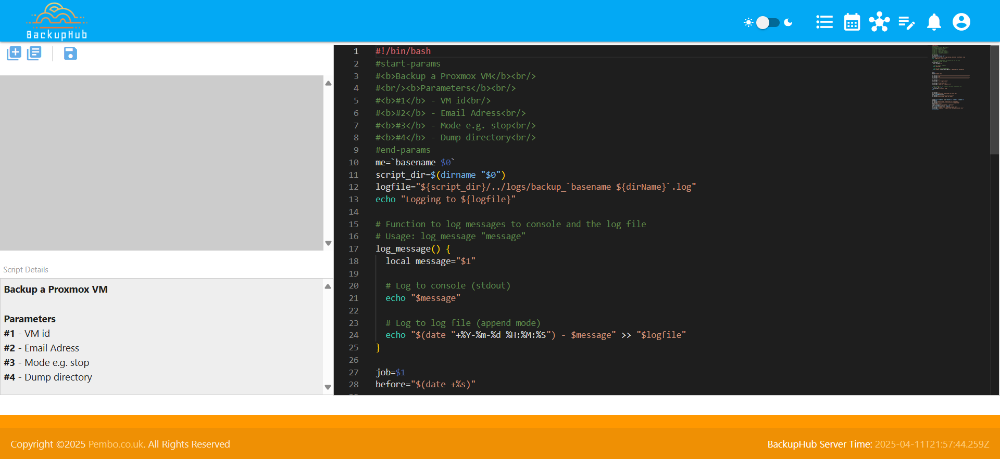

# Backup Schedules

Creating a backup schedule is a relatively simple task.  This guide will take you step by step through adding a schedule for a test job.


> Prerequsities
>1. You've installed the BackupHub Server following the installation guide
>2. You've deployed an agent - this can be on the same machine as the BackupHub server, or any other machine.
>3. You'll need to have a backup script to use.  This guide will utilize a test script.

## Creating a schedule

### 1. Create a backup script
First we need a backup shell script.  You can do this manually, or reuse any script you already have, but for this guide, we'll make use of a test template.

#### 1.1 Script Editor
Acces the script edito using from the toolbar using the following icon:


#### 1.2 Create/Use a template script
The script editor is likely to be empty if you've not already created some scripts, so lets use a template script to create our first job.

In the script editor

Click the tempalates icon.  This will connect to the URL defined in settings for templates.  By default this will be set to:
```https://www.pembo.co.uk/BackupHub/template-repository/``` which is a template repository of backup jobs provided by BackupHub based on Pembo's own backup needs.

Clicking the icon (2nd icon) will bring up the templates list


Scroll down the templates till you find
__"Test-Custom-Delay"__.  Pressing on the card will show you the actual backup script.  This script is very simple and performs 5 parameterized sleep statements, and is replicated here just for information.  Details on scripts will be provided in another documentation section. 

```
#!/bin/bash
#start-params
#<b>Test Shell Sript that performs a set of sleep statements</b><br/>
#<br/><b>Parameters</b><br/>
#<b>Param 1</b> - Sleep value in Secs<br/>
#<b>Param 2</b> - Sleep value in Secs<br/>
#<b>Param 3</b> - Sleep value in Secs<br/>
#<b>Param 4</b> - Sleep value in Secs<br/>
#<b>Param 5</b> - Sleep value in Secs<br/>
#end-params
echo STARTED
echo "Stage 1 - Sleeping for $1"
sleep $1
echo "Stage 2 - Sleeping for $2"
sleep $2
echo "Stage 3 - Sleeping for $3"
sleep $3
echo "Stage 4 - Sleeping for $4"
sleep $4
echo "Stage 5 - Sleeping for $5"
sleep $5
echo "final stage"
echo COMPLETED
```
Press the ```USE TEMPLATE``` button to use this template.

Now you'll see the script listed in the editor where you can make changes, but for now, lets use this as is, and just press the save icon.

This will prompt you for a name.  Lets just call this ```test-delay.sh```.
Then press save.

You'll now see the file listed in the editor so you can come back and edit this later.

#### 1.3 Create a Schedule
Now we have a script we can create a schedule. To do this press the Job Schedule icon in the toolbar.

This will take you to the schedule list screen


This will be blank initially, but will subsequently list your scheduled jobs.

Press the blue ```+``` icon to add a new schedule.
This will take you to the schedule specification screen


Here we need to provide some details about the job, you can follow these suggestions, or type something of your choice :)

__Job Name:__
```Test job```

__Icon:__
```save```

__Colour:__
```Leave as black```

__Description:__
```This is a test job```

__Schedule Type:__
```Daily```

__Schedule Time:__ 
```00:00```

__Agent:__
Please select your previoulsy installed (and running) agent

__Command File:__
```test-delay.sh```

__Parameters:___ ```1 1 5 1 2```

Then press 'SAVE'

You'll now be taken back to the schedule list and see your job has been created.  Just for fun, you might want to try changing between the list and calendar views, but before moving on, please switch back to the list view!

>__Note:__ When you run a job, the average runtime is represented in the calendar view to make it easier to plan/schedule jobs without crossover.  It's only possible also to schedule jobs at the top or bottom of the hour, i.e. on the hour, or half past the hour.

#### 1.3 Run your job
From the list view, at the right hand of your job list, you'll see a run icon!  Press this to run your job.

You'll be navigate to the manual job execution screen


Which will stream the log entries from the job, and will track this through to completion.


### Explore!
From here, you can start to explore.  The monitor and dashboard will show your job entries. You could even take a look at the agent information!

You might also want to try and create a script of your own, edit a script, add more agents, ... 


