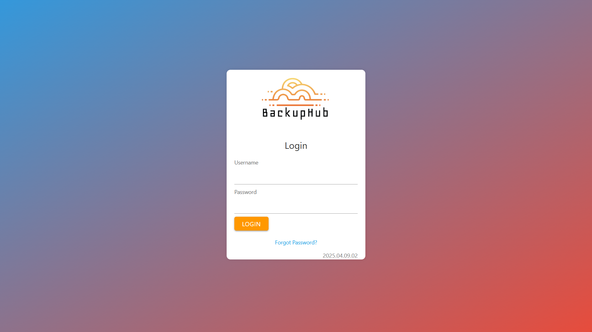
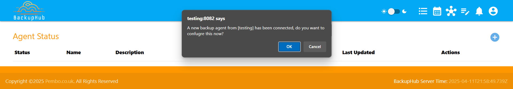

# Getting Started
This secition of the docs guides you through getting started with BackupHub

## BackupHub Server

The BackupHub server is recommended to be installed and executed through the released container image in this repository, however you can run this directly on your server using node

### Container Setup

#### Pre-requisites
Please ensure you have Docker or any other container execution platform installed.  This documentation assumes the usage of Docker

#### Start an instance of this image

The latest version image can be found here:
```ghcr.io/dpembo/backuphub/hub:latest```

If you want specific versions, you can find these in the packages section of this repository

Starting a Backup server instance is simple:

```
docker run \
  -d \
  --name BackupHub \
  -e TZ=Europe/London \
  -p 8082:8082 \
  -p 49981:49981 \  
  --restart unless-stopped \ 
  -v /custom/BackupHub/data:/usr/src/app/data \
  -v /custom/BackupHub/scripts:/usr/src/app/scripts \ 
  -v /custom/BackupHub/logs:/usr/src/app/logs \
  ghcr.io/dpembo/backuphub/hub:latest
```

#### Parameter Details


| Environment Variable | Description | Example |
|---|---|--|
| TZ | Time zone to ensure the container operates in your correct time zone for display of date/times.  Time zone names follow the standard IANA database, of which you can find a list via [wikipedia](https://en.wikipedia.org/wiki/List_of_tz_database_time_zones)| Europe/London |
| BACKUPHUB_ENCRYPTION_KEY | This variable is used to provide the encryption key used between the Hub and Agents to ensure the data/commmands cannot be compromised, or the link from agent to server be misued.  This has a default value, but its recommended to change this|MySecretKey|
| | | |
| **Volume** | **Description** | **Example** |
| /usr/src/app/data | This volume is used to hold all the various data that BackupHub uses including job history, user setup, configuration and statistics |-v custom/data:/usr/src/app/data
| usr/src/app/scripts | This is where all your backup/any other shell scripts you schedule are stored|/etc/scripts|
| usr/src/app/logs | Directory where log information can be outputted|/var/logs/BackupHub|
| | | |
| **Port** | **Description** | **Example** |
| 8082 | The port the web application is hosted on | -p 8080:8082 |
| 49981 | websocket server port used for server/agent communication | -p 49981:49981 |

### Manual Installation
Details instructions are provided here as it's recommended to run this from the container image, however it is just a node.js server applciation, so can be setup by: 
* Cloning the repo
* Installing Node (v20/v21)
* Using NPM to install libs
* Setting environment variables appropritate
* Launching the app (server.js)

## BackupHub Server Console ##
Login to the BackupHub Server Console via a webbrowser on your server/ip with the given port, which by default is 8082. e.g.
```http://localhost:8082```

### Initial User creation
First you will be asked to create a user:


You need to provide the following:
* A username
* An email address to associate with that username
* A password

Then Press 'REGISTER' to continue

### Login
After creating the user, it will then ask you to login with that user.



**Note:**

```If for any reason you cannot login, simply delete the user.db directory found in the data location, and then restart the server.```

### Welcome
You'll now be taken to the welcome screen

Please press 'NEXT' to continue

### Server Settings
Next you'll be asked to provide some server settings

* **Timezone** is utlized to ensure dates are shown in the configured timezone.  It's recommended the timezone match that of the server runtime, or the environment variable provided to a container. If an environment variable is set, this will ne defaulted to that value.
* **Hostname** is the name of the host used in emails, notifications, etc
* **Web Server Port** is the webserver port. Please note, that if you are running as a container, you should not change this, and simply change the port mapping for the container.
* **Websocker Server Port** is the port for the websocker server, which is used by agents to communicate with the BackupHub server.  It's recommended to leave this as the default.

Once completed/confirmed, please press "Next"

* **Completed** you've now completed the initial setup, press next to launch the BackupHub Console.


## BackupHub Agent

### Navigate to Agents Provision
Once logged into the Hub, navigate to the agents screen from the top menu

  

Which will take you here:
  


### Add Agent
1. simply press the (+) button in in the agents screen, which will bring up the agent install command


2. Press the copy icon (or copy the full command text), and paste this into a terminal running as root or with appropriate permissions.

then press return to execute

3. As you've run this from the BackupHub server console, a number of parameters are defaulted in the command you copied, therefore you'll next see a message indicating this:

Please press 'ok' to continue.

4. You now get the option to continue with the defaulted values (recommended), or to start a new setup, or simply exit the agent installer.

Leave this as "Use Provided Settings" and press ok.

5. Next you can provide a suitable agent name.  Please note agent names must be unique, so ensure as you deploy other agents you provide a unique name.  You could base this in the servername, or even the last octet of the IP Address.

Provide an agent name, and press "OK" to continue

6. The next choice is whether to use MQTT or Websocket.

Websocket is recommended, therefore leave this options as WebSocket and choose 'OK' to continue

7. Next you need to provide the server name.  

The default will already be provided from the command you pasted, so you can leave this empty and press 'OK' to select the default

8. Next confirm/modify the WebSocket server port:

Its recommended to leave this as the default and should match the configured port from the server, then press "OK" to continue.

9. Next confirm the working directory where scripts are created and executed.

By default this is set to /tmp, but can be changed to any path where the agent can access.  Then press "OK" to continue.

10. The final choice is to determine how to start the agent.  There are multiple choices here
 Use PM2. See [here](https://www.npmjs.com/package/pm2), use Crontab, Run as a service, Configure and create a container and execute (requires docker), or none, which will require manual execution, i.e. ```node agent.js```.  Please determine the most appropriate option, or if not known, proceeed with PM2.

At this point, the agent will run through the installation process and start.

Now switch back to the BackupHub server console, where you'll see a notification once the agent has started:



Simply press "OK" to confirm the connected agent


Then press submit, and your agent will be added


**Congratulations, you've added your first agent!**


